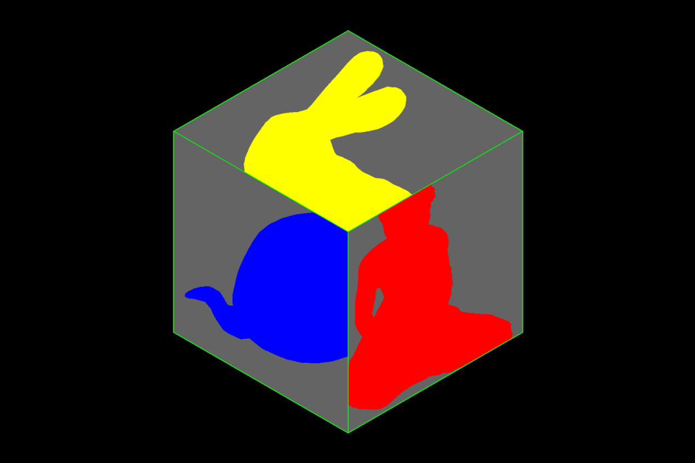

# p5.tree

[](https://www.npmjs.com/package/p5.tree)

Shader tools, animation tracks, camera keyframe interpolation, space transforms, and parameter panels for 3D rendering with [p5.js v2](https://beta.p5js.org/) ([WEBGL](https://beta.p5js.org/reference/p5/constants/webgl/) / [WEBGL2](https://beta.p5js.org/reference/p5/constants/webgl2/) / [WebGPU](https://beta.p5js.org/reference/p5/constants/webgpu/)).



* [Tracks](#tracks)
  * [PoseTrack — object animation](#posetrack--object-animation)
  * [CameraTrack — camera keyframe paths](#cameratrack--camera-keyframe-paths)
  * [Playback options](#playback-options)
  * [Camera helpers](#camera-helpers)
* [Space transformations](#space-transformations)
  * [Matrix operations](#matrix-operations)
  * [Matrix queries](#matrix-queries)
  * [Frustum queries](#frustum-queries)
  * [Coordinate space conversions](#coordinate-space-conversions)
  * [Heads Up Display](#heads-up-display)
* [Panels](#panels)
  * [Parameter panel](#parameter-panel)
  * [Track transport panel](#track-transport-panel)
  * [Collapsible panels](#collapsible-panels)
* [Post-processing](#post-processing)
  * [pipe](#pipe)
  * [releasePipe](#releasepipe)
* [Utilities](#utilities)
* [Drawing stuff](#drawing-stuff)
* [Releases](#releases)
* [Usage](#usage)
  * [CDN](#cdn)
  * [npm (ESM)](#npm-esm)

---

# Tracks

A unified factory creates either a **PoseTrack** (object animation) or a **CameraTrack** (camera keyframe path), depending on whether a camera is passed.

```js
const track = createTrack()             // PoseTrack — animates any object
const track = createTrack(cam)          // CameraTrack — drives a p5.Camera
const track = createTrack(getCamera())  // CameraTrack on the default camera
```

## PoseTrack — object animation

Stores `{ pos, rot, scl }` keyframes. Interpolates position with centripetal Catmull-Rom, rotation with slerp or nlerp, scale with linear.

```js
const track = createTrack()
const out   = { pos:[0,0,0], rot:[0,0,0,1], scl:[1,1,1] }

track.add({ pos:[-150, 0, 0], rot:[0,0,0,1], scl:[1,1,1] })
track.add({ pos:[ 150, 0, 0], rot:[0,0,0,1], scl:[1,1,1] })
track.play({ loop: true, duration: 60 })

function draw() {
  background(20)
  if (track.playing) {
    push()
    applyPose(track.eval(out))
    box(60)
    pop()
  }
}
```

`add()` accepts flexible specs. Top-level forms:

```js
track.add({ pos, rot, scl })       // explicit TRS — rot accepts any form below
track.add({ mMatrix: mat4 })       // decompose model matrix into TRS
track.add([ spec, spec, ... ])     // bulk
```

`rot` sub-forms — all normalised internally, no pre-processing needed:

```js
track.add({ pos:[0,0,0], rot: [x,y,z,w] })                          // raw quaternion
track.add({ pos:[0,0,0], rot: { axis:[0,1,0], angle: PI/4 } })      // axis-angle
track.add({ pos:[0,0,0], rot: { dir:[1,0,0] } })                    // look direction
track.add({ pos:[0,0,0], rot: { euler:[rx,ry,rz] } })               // intrinsic YXZ (default)
track.add({ pos:[0,0,0], rot: { euler:[rx,ry,rz], order:'XYZ' } })  // explicit order
track.add({ pos:[0,0,0], rot: { from:[0,0,1], to:[1,0,0] } })       // shortest arc
track.add({ pos:[0,0,0], rot: { mat3: rotationMatrix } })           // 3×3 col-major
track.add({ pos:[0,0,0], rot: { eMatrix: eyeMat } })                // from eye matrix
```

Supported Euler orders: `YXZ` (default, matches p5 Y-up), `XYZ`, `ZYX`, `ZXY`, `XZY`, `YZX`. All are intrinsic — extrinsic `ABC` equals intrinsic `CBA` with the same angles.

Interpolation modes:

```js
track.posInterp = 'catmullrom'  // default — smooth curves
track.posInterp = 'linear'

track.rotInterp = 'slerp'       // default — constant angular velocity
track.rotInterp = 'nlerp'       // faster, slightly non-constant speed
```

`eval(out)` writes into a pre-allocated buffer — zero heap allocation per frame. Use `toMatrix(outMat4)` to evaluate directly into a column-major mat4.

## CameraTrack — camera keyframe paths

Stores `{ eye, center, up }` lookat keyframes. Playback applies automatically each frame via `cam.camera()` — no draw-loop guard needed.

```js
let cam, track

function setup() {
  createCanvas(600, 400, WEBGL)
  cam   = createCamera()
  track = createTrack(cam)

  track.add({ eye:[0,0,500], center:[0,0,0] })
  track.add({ eye:[300,-150,0], center:[0,0,0] })
  track.add({ eye:[-200,100,-300], center:[0,0,0] })
  track.play({ loop: true, duration: 90 })
}

function draw() {
  background(20)
  setCamera(cam)
  orbitControl()   // works freely when track is stopped
  axes(); grid()
}
```

`add()` accepts multiple forms:

```js
track.add({ eye, center?, up? })   // explicit lookat; center defaults to [0,0,0], up to [0,1,0]
track.add({ vMatrix: mat4 })       // view matrix (world→eye); eye reconstructed via -R^T·t
track.add({ eMatrix: mat4 })       // eye matrix (eye→world); eye read from col3
track.add(cam.capturePose())       // capture live camera state (zero-alloc with pre-allocated out)
track.add()                        // shortcut — captures track's bound camera
track.add([ spec, spec, ... ])     // bulk
```

`vMatrix` and `eMatrix` both default `up` to `[0,1,0]`. Pass `cam.capturePose()` when the real up hint needs preserving.

Interpolation modes:

```js
track.eyeInterp    = 'catmullrom'  // default
track.eyeInterp    = 'linear'

track.centerInterp = 'linear'      // default — suits fixed lookat targets
track.centerInterp = 'catmullrom'  // smoother when center is also flying
```

## Playback options

All tracks share the same transport API:

```js
track.play({ duration, loop, pingPong, rate, onPlay, onEnd, onStop })
track.stop([rewind])   // rewind=true seeks to origin
track.reset()          // clear all keyframes and stop
track.seek(t)          // t ∈ [0, 1]
track.time()           // → number ∈ [0, 1]
track.info()           // → { keyframes, segments, playing, loop, ... }
track.add(spec)        // append keyframe(s)
track.set(i, spec)     // replace keyframe at index
track.remove(i)        // remove keyframe at index
```

| Option     | Default | Description                                    |
|------------|---------|------------------------------------------------|
| `duration` | `30`    | Frames per segment.                            |
| `loop`     | `false` | Wrap at boundaries.                            |
| `pingPong` | `false` | Bounce at boundaries.                          |
| `rate`     | `1`     | Playback speed (negative reverses direction).  |
| `onPlay`   | —       | Fires when playback starts.                    |
| `onEnd`    | —       | Fires at natural end (once mode only).         |
| `onStop`   | —       | Fires on explicit `stop()` or `reset()`.       |

Hook firing order:
```
play()  → onPlay → _onActivate
tick()  → onEnd  → _onDeactivate   (once mode, at boundary)
stop()  → onStop → _onDeactivate
reset() → onStop → _onDeactivate
```

`track.playing`, `track.loop`, `track.pingPong`, `track.rate`, `track.duration`, `track.keyframes` — readable at any time.

One-keyframe behaviour: `play()` with exactly one keyframe snaps `eval()` without starting playback or firing hooks.

## Camera helpers

```js
getCamera()              // returns curCamera — use with createTrack()

cam.capturePose()        // → { eye, center, up } from live camera state
cam.capturePose(out)     // zero-allocation form with pre-allocated out

cam.applyPose(pose)      // apply { eye, center, up } → cam.camera()
                         // also accepts { pos, rot, scl } TRS (shake / bob)

applyPose(pose)          // apply { pos, rot, scl } to the transform stack
rotateQuat(q)            // rotate by [x,y,z,w] quaternion
```

---

# Space transformations

## Matrix operations

`createMatrix(...args)` — convenience wrapper around `new p5.Matrix(...args)`.

## Matrix queries

All matrix queries share the same contract:
- `out` is the **first** parameter — the caller owns the buffer
- returns `out` (or `null` on a singular matrix)
- no allocations — pass the same buffer every frame

Accepted types for `out` and override params: `Float32Array` | `ArrayLike` | `p5.Matrix`

**Simple queries** — read from live renderer state:

```js
eMatrix(out)   // eye matrix (inverse view) — eye→world
pMatrix(out)   // projection matrix
vMatrix(out)   // view matrix — world→eye
mMatrix(out)   // model matrix — local→world
```

**Composite queries** — `out` first, optional overrides in an opts object:

```js
pvMatrix(out,  [{ pMatrix, vMatrix }])
ipvMatrix(out, [{ pMatrix, vMatrix, pvMatrix }])
mvMatrix(out,  [{ mMatrix, vMatrix }])
pmvMatrix(out, [{ pMatrix, mMatrix, vMatrix }])
nMatrix(out,   [{ mMatrix, vMatrix, mvMatrix }])  // 9-element out
lMatrix(out, from, to)   // location transform: inv(to) · from
dMatrix(out, from, to)   // direction transform: to₃ · inv(from₃), 9-element out
```

**Zero-allocation draw-loop pattern:**

```js
// setup — allocate once
const e  = new Float32Array(16)
const pm = new Float32Array(16)
const pv = new Float32Array(16)

// draw — zero allocations
eMatrix(e)
pMatrix(pm)
pvMatrix(pv)
viewFrustum({ eMatrix: e, pMatrix: pm })
mousePicking({ pvMatrix: pv, eMatrix: e })
```

## Frustum queries

Scalars read directly from the projection matrix — no buffer needed:

```js
lPlane()   rPlane()   bPlane()   tPlane()   // side planes
nPlane()   fPlane()                          // near / far
fov()      hfov()                            // field of view (radians)
isOrtho()                                    // true for orthographic
```

## Coordinate space conversions

```js
mapLocation(out, point, [opts])   // map a point between spaces
mapLocation(out, [opts])          // input defaults to p5.Tree.ORIGIN
mapLocation(out)                  // defaults to ORIGIN, EYE → WORLD

mapDirection(out, vector, [opts]) // map a direction between spaces
mapDirection(out, [opts])         // input defaults to p5.Tree._k
mapDirection(out)                 // defaults to _k, EYE → WORLD
```

`out` is a 3-element `Float32Array`, `ArrayLike`, or `p5.Vector`.

| Option      | Default           | Description                             |
|-------------|-------------------|-----------------------------------------|
| `from`      | `p5.Tree.EYE`     | Source space (constant or matrix).      |
| `to`        | `p5.Tree.WORLD`   | Target space (constant or matrix).      |
| `eMatrix`   | current eye       | Pre-computed eye matrix.                |
| `pMatrix`   | current proj      | Override projection matrix.             |
| `vMatrix`   | current view      | Override view matrix.                   |
| `pvMatrix`  | P·V               | Pre-computed PV — skips multiply.       |
| `ipvMatrix` | inv(PV)           | Pre-computed IPV — skips inversion.     |

`from` / `to` accept: `p5.Tree.WORLD`, `EYE`, `SCREEN`, `NDC`, `MODEL`, or a mat4 for a custom local frame.

```js
const loc = new Float32Array(3)
const dir = new Float32Array(3)

mapLocation(loc)                                                    // camera world position
mapDirection(dir)                                                   // camera view direction
mapLocation(loc, [100,0,0], { from: p5.Tree.WORLD, to: p5.Tree.SCREEN })
```

Constants: `p5.Tree.ORIGIN`, `p5.Tree.i`, `p5.Tree.j`, `p5.Tree.k`, `p5.Tree._i`, `p5.Tree._j`, `p5.Tree._k`.

## Heads Up Display

Draw directly in screen space — independent of the current camera and 3D transforms.

```js
beginHUD()
text('FPS: ' + frameRate().toFixed(1), 10, 20)
endHUD()
```

Coordinates: `(x, y) ∈ [0, width] × [0, height]`, origin top-left, y increasing downward.

---

# Panels

A unified `createPanel` factory covers parameter bindings and track transport controls. The first argument determines the panel type.

```js
createPanel(track,  opt)   // transport panel
createPanel(schema, opt)   // parameter panel
```

## Parameter panel

Binds named parameters to DOM controls. When `target` is provided, values are pushed automatically every frame.

```js
createPanel({
  blurRadius: { min: 0, max: 10, value: 2, step: 0.1 },
  showGrid:   { value: true },
  tint:       { value: '#ff8844' },
}, { target: myShader, x: 10, y: 10, labels: true, color: 'white' })
```

`target` can be a p5 shader (calls `setUniform` automatically), a plain function `(name, value) => ...`, or an object with `.set(name, value)`. Omit `target` to read values manually via `panel.name.value()`.

| Option        | Default | Description                               |
|---------------|---------|-------------------------------------------|
| `target`      | —       | Value sink.                               |
| `labels`      | `false` | Show per-binding labels.                  |
| `title`       | —       | Bold title row.                           |
| `collapsible` | `false` | Title row becomes a collapse toggle.      |
| `collapsed`   | `false` | Start collapsed (implies collapsible).    |
| `color`       | —       | Text color.                               |
| `x`, `y`      | `0`     | Position (px).                            |
| `width`       | `120`   | Slider width (px).                        |
| `hidden`      | `false` | Start hidden.                             |
| `parent`      | canvas container | Mount target.                    |

## Track transport panel

```js
createPanel(track, { x: 10, y: 10, color: 'white' })
```

| Option      | Default     | Description                                    |
|-------------|-------------|------------------------------------------------|
| `seek`      | `true`      | Show seek slider.                              |
| `props`     | `true`      | Show rate slider + mode select.                |
| `info`      | `false`     | Show time/keyframe readout.                    |
| `rate`      | track.rate  | Initial rate.                                  |
| `loop`      | track.loop  | Initial loop mode.                             |
| `pingPong`  | track.pingPong | Initial pingPong mode.                      |
| `depth`     | `0.5`       | Initial + button depth [0..1].                 |
| `camera`    | curCamera   | Camera for + button. `null` suppresses it.     |

Lifecycle hooks can be passed directly in opt:

```js
createPanel(track, {
  onPlay: t => console.log('playing'),
  onEnd:  t => console.log('done'),
  onStop: t => console.log('stopped'),
  x: 10, y: 10
})
```

**Returned handle** (both panel types):

```js
panel.el            // HTMLElement container
panel.visible       // get/set boolean
panel.collapsed     // get/set boolean (requires collapsible + title)
panel.parent(el)    // re-mount into a different HTMLElement
panel.tick()        // called automatically — no need to call manually
panel.dispose()     // remove from DOM
```

## Collapsible panels

Any panel with a `title` can be made collapsible. Clicking the title row toggles the content.

```js
createPanel(schema, { title: 'Noise', collapsible: true, collapsed: true })
createPanel(track,  { title: 'Camera path', collapsible: true })
```

Programmatic control:

```js
panel.collapsed = true
panel.collapsed = false
```

---

# Post-processing

A lightweight multi-pass pipeline for `p5.Framebuffer`, `p5.strands`, and standard WebGL rendering. `pipe()` chains filter shaders, reuses internal ping/pong framebuffers, and optionally displays the result. Framebuffers are lazily allocated and released on sketch removal.

## pipe

```js
pipe(source, passes, options)
```

| Parameter | Description                                           |
|-----------|-------------------------------------------------------|
| `source`  | `p5.Framebuffer`, texture, image, or graphics.       |
| `passes`  | Array of filters, or a single filter instance.       |
| `options` | See table below.                                     |

| Option           | Default         | Description                                         |
|------------------|-----------------|-----------------------------------------------------|
| `display`        | `true`          | Draw final output to the main canvas.               |
| `allocate`       | `true`          | Auto-allocate and cache internal ping/pong.         |
| `key`            | `'default'`     | Cache key for multiple independent pipelines.       |
| `ping` / `pong`  | —               | User-provided framebuffers (advanced override).     |
| `clear`          | `true`          | Clear each pass target before drawing.              |
| `clearDisplay`   | `true`          | Clear main canvas before final blit.                |
| `clearFn`        | `background(0)` | Custom clear strategy for passes.                  |
| `clearDisplayFn` | `clearFn`       | Custom clear strategy for display stage.            |
| `draw`           | full blit       | Custom draw strategy for placing texture on target. |

## releasePipe

```js
releasePipe()         // release default pipeline
releasePipe(true)     // release all pipelines
releasePipe('key')    // release a named pipeline
```

---

# Utilities

```js
p5.Tree.VERSION   // '0.0.20'
```

**Visibility testing** — frustum culling against the current camera:

```js
visibility({ corner1, corner2 })    // box
visibility({ center, radius })      // sphere
visibility({ point })               // point
// → p5.Tree.VISIBLE | SEMIVISIBLE | INVISIBLE
```

**Picking:**

```js
mousePicking({ pvMatrix, eMatrix, [shape] })
// shape: p5.Tree.CIRCLE (default) | p5.Tree.SQUARE
```

---

# Drawing stuff

```js
axes([{ size, bits, mMatrix, eMatrix, pMatrix, vMatrix, pvMatrix }])
grid([{ size, subdivisions }])
bullsEye([{ size, shape }])
cross([{ size }])
viewFrustum({ pg, eMatrix, pMatrix, vMatrix, bits, viewer })
```

`axes` bits: `p5.Tree.X`, `p5.Tree._X`, `p5.Tree.Y`, `p5.Tree._Y`, `p5.Tree.Z`, `p5.Tree._Z`, `p5.Tree.LABELS`.

`viewFrustum` bits: `p5.Tree.NEAR`, `p5.Tree.FAR`, `p5.Tree.BODY`, `p5.Tree.APEX`.

Matrix params accept `Float32Array(16)` | `ArrayLike` | `p5.Matrix` throughout.

---

# Releases

Latest:

* [https://cdn.jsdelivr.net/npm/p5.tree/dist/p5.tree.js](https://cdn.jsdelivr.net/npm/p5.tree/dist/p5.tree.js)
* [https://cdn.jsdelivr.net/npm/p5.tree/dist/p5.tree.min.js](https://cdn.jsdelivr.net/npm/p5.tree/dist/p5.tree.min.js)
* [https://cdn.jsdelivr.net/npm/p5.tree/dist/p5.tree.esm.js](https://cdn.jsdelivr.net/npm/p5.tree/dist/p5.tree.esm.js)
* [https://www.npmjs.com/package/p5.tree](https://www.npmjs.com/package/p5.tree)

Tagged:

* [https://cdn.jsdelivr.net/npm/p5.tree@0.0.20/dist/p5.tree.js](https://cdn.jsdelivr.net/npm/p5.tree@0.0.20/dist/p5.tree.js)
* [https://cdn.jsdelivr.net/npm/p5.tree@0.0.20/dist/p5.tree.min.js](https://cdn.jsdelivr.net/npm/p5.tree@0.0.20/dist/p5.tree.min.js)
* [https://cdn.jsdelivr.net/npm/p5.tree@0.0.20/dist/p5.tree.esm.js](https://cdn.jsdelivr.net/npm/p5.tree@0.0.20/dist/p5.tree.esm.js)

---

# Usage

## CDN

```html
<script src="https://cdn.jsdelivr.net/npm/p5/lib/p5.min.js"></script>
<script src="https://cdn.jsdelivr.net/npm/p5.tree/dist/p5.tree.js"></script>

<script>
  function setup() {
    createCanvas(600, 400, WEBGL)
    axes()
  }

  function draw() {
    background(0.15)
    orbitControl()
  }
</script>
```

Works in global and instance mode.

## npm (ESM)

```bash
npm i p5 p5.tree
```

```js
import p5 from 'p5'
import 'p5.tree'

const sketch = p => {
  p.setup = () => {
    p.createCanvas(600, 400, p.WEBGL)
    p.axes()
  }

  p.draw = () => {
    p.background(0.15)
    p.orbitControl()
  }
}

new p5(sketch)
```
